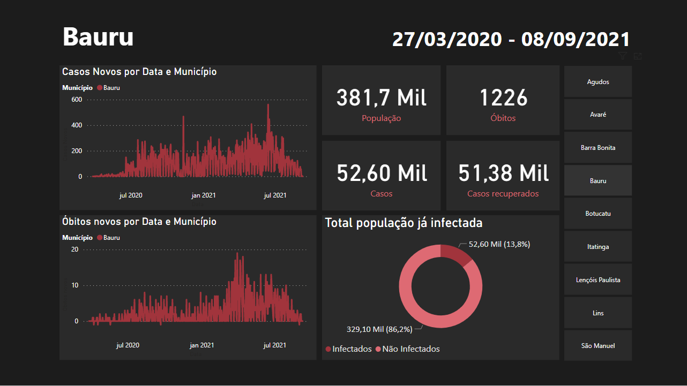

# Dashboard Power Bi - Covid-19 nas cidades Bauru e região

## Objetivo
Criar um Dashboard para análise da situação do covid-19 em algumas cidades da região de Bauru, interior de São Paulo, durante o período de 27/03/2020 a 08/09/2021 (dia que o projeto foi finalizado). 

## Cidades abrangidas na análise
- Bauru
- Botucatu
- Avaré
- Lins
- Lençóis Paulista
- São Manuel
- Agudos
- Barra Bonita
- Itatinga

## Sobre o Dashboard
O dashboard desenvolvido contém as informações: **nome do munícipio, população, total de casos, total de óbitos, total de recuperados, relação entre população infectada e não infectada, evolução do número de casos e óbitos novos por dia**. O mesmo foi criado através do software Power Bi, utilizando os dados contidos na tabela "cidades.csv", e pode ser acessado clicando [aqui](https://app.powerbi.com/view?r=eyJrIjoiNGVjYjVkM2MtMTVhMi00MDA3LTg0NmMtMzI3ZWJiZTk1OTA4IiwidCI6IjdiYjIwZjJkLTUwNzItNDI2Ni1hNGE1LTJhZjcxYzNjNzBhMSJ9&pageName=ReportSection) ou através do link: https://app.powerbi.com/view?r=eyJrIjoiNGVjYjVkM2MtMTVhMi00MDA3LTg0NmMtMzI3ZWJiZTk1OTA4IiwidCI6IjdiYjIwZjJkLTUwNzItNDI2Ni1hNGE1LTJhZjcxYzNjNzBhMSJ9&pageName=ReportSection.

Exemplo dashboard com cidade Bauru selecionada:

## Sobre os dados - Origem
1. Os dados originais foram obtidos no [site do governo](https://qsprod.saude.gov.br/extensions/covid-19_html/covid-19_html.html) e colocados na pasta "Dados" do projeto, com o nome "export.csv";
2. Os dados lidos pelo Power Bi estão contidos em "cidades.csv", arquivo criado com a execução do script "clean_and_filter.py", que faz a limpeza e filtragem dos dados originais contidos no "export.csv" de acordo com as cidades abrangidas nessa análise.

*Vale ressaltar que, como o arquivo "export.csv" é muito grande, o mesmo não pôde ser armazenado nesse repositório. Portanto, para ter acesso a esses dados é necessário realizar o download novamente através do link https://qsprod.saude.gov.br/extensions/covid-19_html/covid-19_html.html*.

## Sobre os dados - Período e estrutura
Os dados utilizados nessa pesquisa foram obtidos diretamente no site do governo a respeito da pandemia no brasil. O período abrangido é desde o início até os dias atuais desse documento (08/09/2021). A tabela tem originalmente as seguintes colunas: **Info, UF, Município, Metro/Interior, Data, Casos Acumulados, Casos Novos, Óbitos Acumulados e Óbitos novos**.

Para acessar o site mencionado e fazer o download dos dados utilizados, clique [aqui](https://qsprod.saude.gov.br/extensions/covid-19_html/covid-19_html.html) ou acesse https://qsprod.saude.gov.br/extensions/covid-19_html/covid-19_html.html.

## Sobre o autor do projeto
Me chamo Vinícius Pilan, sou estudante de Ciência da Computação pela Universidade Estadual Paulista 'Júlio de Mesquita Filho' UNESP, no campus de Bauru. Pretendo me especializar na área de dados e este projeto faz parte do meu portifólio de projetos. Para saber mais sobre mim e outros projetos de autoria minha, deixo algumas das minhas redes sociais:

- **Linkedin:** Vinícius de Paula Pilan
- **GitHub:** [ViniPilan](https://github.com/ViniPilan)
- **GitHub do projeto:** [ViniPilan/covid-analise-bauru-e-regiao](https://github.com/ViniPilan/covid-analise-bauru-e-regiao).
